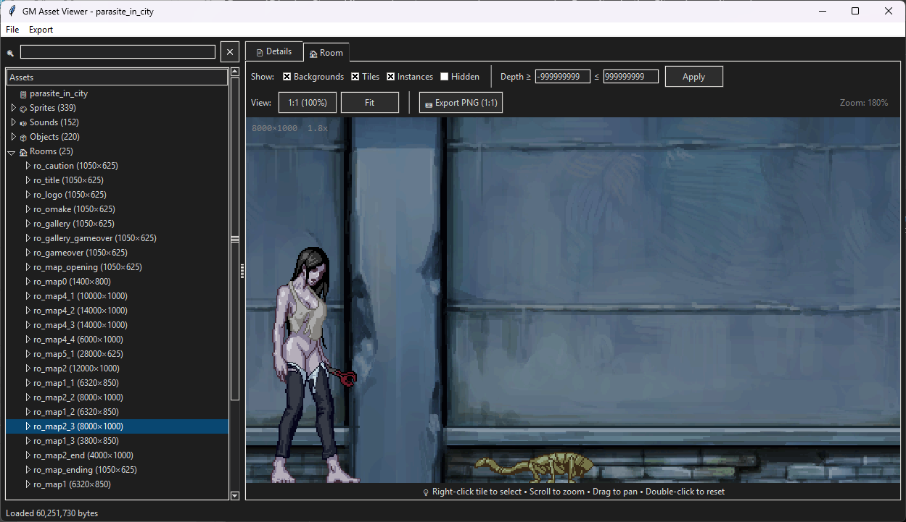

# 🎮 Parasite In City Inspector

<p align="center">
  
</p>

<p align="center">
  <a href="#features">Features</a> •
  <a href="#installation">Installation</a> •
  <a href="#usage">Usage</a> •
  <a href="#supported-formats">Formats</a> •
  <a href="#wiki">Wiki</a> •
  <a href="#license">License</a>
</p>

<p align="center">
  
  
  
  
  
</p>

---

A powerful desktop application for exploring, previewing, and extracting assets from **Game Maker Studio** games. Originally developed to explore and document assets from **Parasite in City** by **Pixel Factory**, this tool provides comprehensive access to sprites, sounds, rooms, objects, and more stored within `data.win` files.

## 🎯 Background

This tool was created to facilitate asset exploration and modding research for **Parasite in City**, a side-scrolling action game developed by **Pixel Factory** using the **Game Maker Studio** engine. The game's assets are stored in the proprietary `data.win` format, which this viewer fully parses and presents in an intuitive interface.

## ✨ Features

### Asset Browsing
- 🎨 **Sprites** - View animated sprites with adjustable FPS, frame-by-frame navigation
- 🔊 **Sounds** - Preview and play audio (OGG, WAV, MP3) with volume information
- 📦 **Objects** - Inspect game objects with their associated sprites and properties
- 🏠 **Rooms** - Full room rendering with backgrounds, tiles, and object instances
- 🌄 **Backgrounds** - View tilesets and background images
- 🎞️ **Textures** - Browse raw texture atlases
- 🔤 **Fonts** - Preview bitmap fonts with glyph information
- 📐 **Paths** - Visualize movement paths with point data
- 📜 **Scripts** - View script names and code references
- ✨ **Shaders** - Inspect GLSL vertex and fragment shader code
- ⏱️ **Timelines** - Browse timeline definitions
- 🔌 **Extensions** - View loaded extensions

### Room Viewer
- **Layer Controls** - Toggle backgrounds, tiles, instances, and hidden objects
- **Depth Filtering** - Filter elements by depth range
- **1:1 Pixel-Perfect View** - View rooms at true resolution
- **Zoom & Pan** - Scroll to zoom (toward cursor), drag to pan
- **Tile Selection** - Right-click tiles to inspect properties
- **PNG Export** - Export entire rooms as flattened PNG images

### General Features
- 🌙 **Dark Theme** - Easy on the eyes during extended sessions
- 🔍 **Search Filter** - Quickly find assets by name
- 📊 **Detailed Info** - Comprehensive property panels for all asset types
- 💾 **Batch Export** - Export sprites, sounds, textures, rooms, and objects
- 📦 **Raw Chunk View** - Hex dump viewer for reverse engineering

## 📋 Requirements

- **Python 3.8+**
- **Pillow** - Image processing
- **pygame** - Audio playback (optional)

## 🚀 Installation

### Using pip

```bash
# Clone the repository
git clone https://github.com/yourusername/gm-asset-viewer.git
cd gm-asset-viewer

# Install dependencies
pip install Pillow pygame

# Run the application
python gm_asset_viewer.py
```

## 📖 Usage

### Opening a Game

1. Launch the application
2. Go to **File → Open** (or press `Ctrl+O`)
3. Select a `data.win` file from any Game Maker game

### Common File Locations

| Platform | File Name | Typical Location |
|----------|-----------|------------------|
| Windows | `data.win` | `<game folder>/data.win` |

### Keyboard Shortcuts

| Key | Action |
|-----|--------|
| `Ctrl+O` | Open file |
| `Scroll` | Zoom in/out |
| `Drag` | Pan view |
| `Double-click` | Reset view / Export asset |
| `Right-click` | Select tile (in room view) |

### Exporting Assets

- **Single Asset**: Double-click any sprite, sound, or texture in the tree
- **Batch Export**: Use the **Export** menu to export entire categories
- **Room Export**: Click "📷 Export PNG (1:1)" in the room viewer

## 📁 Supported Formats

### Input
- `data.win` - Windows Game Maker data file

### Output
- **Sprites**: PNG sequences
- **Sounds**: OGG, WAV, MP3 (original format)
- **Textures**: PNG
- **Rooms**: JSON (data) or PNG (rendered)
- **Objects**: JSON

## 📚 Wiki

For detailed technical documentation on the `data.win` file format, see the [Wiki](../../wiki):

- [File Format Overview](../../wiki/File-Format-Overview)
- [Chunk Reference](../../wiki/Chunk-Reference)
- [TPAG Texture Pages](../../wiki/TPAG-Texture-Pages)
- [Room Structure](../../wiki/Room-Structure)
- [Sprite Animation](../../wiki/Sprite-Animation)

## 🏗️ Project Structure

```
gm-asset-viewer/
├── gm_asset_viewer.py    # Main application
├── README.md             # This file
├── LICENSE               # MIT License
├── preview.png           # Screenshot
├── requirements.txt      # Python dependencies
└── wiki/                 # Documentation
    ├── File-Format-Overview.md
    ├── Chunk-Reference.md
    └── ...
```

## 🔧 Technical Details

### Parsed Chunks

| Chunk | Description | Status |
|-------|-------------|--------|
| GEN8 | General game info | ✅ Full |
| STRG | String table | ✅ Full |
| TXTR | Texture pages | ✅ Full |
| TPAG | Texture page items | ✅ Full |
| SPRT | Sprites | ✅ Full |
| SOND | Sound definitions | ✅ Full |
| AUDO | Audio data | ✅ Full |
| BGND | Backgrounds | ✅ Full |
| OBJT | Objects | ✅ Full |
| ROOM | Rooms | ✅ Full |
| FONT | Fonts | ✅ Full |
| PATH | Paths | ✅ Full |
| SCPT | Scripts | ✅ Names only |
| SHDR | Shaders | ✅ Full |
| TMLN | Timelines | ✅ Partial |
| EXTN | Extensions | ✅ Names only |
| CODE | Bytecode | ❌ Not parsed |
| VARI | Variables | ❌ Not parsed |
| FUNC | Functions | ❌ Not parsed |

### Performance Optimizations

- **Tileset Caching** - Background images pre-extracted on load
- **Room Caching** - Rendered rooms cached by filter settings
- **Lazy Loading** - Textures decoded on demand
- **Efficient Rendering** - NEAREST interpolation for pixel art

## ⚠️ Disclaimer

This tool is intended for **educational purposes**, **modding**, and **personal asset backup**. Please respect game developers' intellectual property rights and do not use extracted assets for unauthorized redistribution or commercial purposes.

## 🙏 Acknowledgments

- **Pixel Factory** - For creating Parasite in City
- **Game Maker Community** - For documenting the data.win format
- **UndertaleModTool** - For format research inspiration

---

<p align="center">
  Made with ❤️ for the Game Maker modding community
</p>

<p align="center">
  <a href="#-game-maker-studio-asset-viewer">Back to Top</a>
</p>
